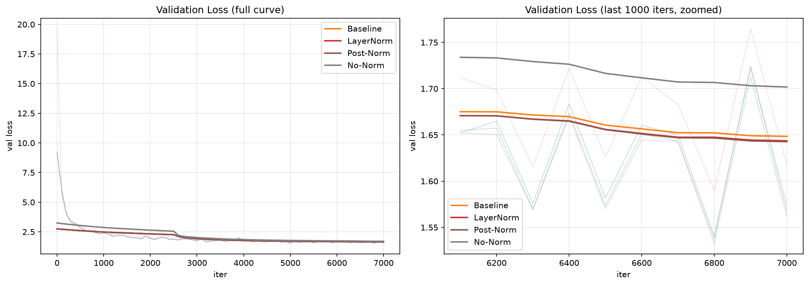

# CS336 Assignment 1: Transformer from Scratch

从零实现(不依赖 `nn.Transformer`)一个 decoder-only Transformer 语言模型的完整训练与推理栈:字节级 BPE 分词、RoPE、因果多头注意力、SwiGLU、RMSNorm、AdamW、余弦学习率调度、checkpoint 断点续训,并在 TinyStories 上完成训练、消融实验与文本生成。

作业说明见 [cs336_assignment1_basics.pdf](./docs/cs336_assignment1_basics.pdf)。

## 实现模块

| 模块     | 文件                            | 说明                                                                                                                    |
| -------- | ------------------------------- | ----------------------------------------------------------------------------------------------------------------------- |
| BPE 训练 | `cs336_basics/BPE.py`           | 字节级 BPE,倒排索引优化合并统计                                                                                         |
| 分词器   | `cs336_basics/tokenizer.py`     | encode / decode / 流式 `encode_iterable`,特殊 token 原子化                                                              |
| 模型     | `cs336_basics/nn.py`            | Embedding、Linear、softmax、SDPA、RoPE、因果多头注意力、SiLU/SwiGLU、RMSNorm/LayerNorm、TransformerBlock、TransformerLM |
| 优化器   | `cs336_basics/optimizer.py`     | SGD(学习率衰减)、AdamW(解耦权重衰减)、全局梯度裁剪                                                                      |
| 调度器   | `cs336_basics/scheduler.py`     | 线性预热 + 余弦退火                                                                                                     |
| 损失     | `cs336_basics/losses.py`        | 数值稳定的交叉熵(log-sum-exp)                                                                                           |
| 数据     | `cs336_basics/data.py`          | memmap 读取 + 随机批量采样                                                                                              |
| 检查点   | `cs336_basics/checkpointing.py` | 模型/优化器状态保存与恢复,断点续训                                                                                      |
| 预处理   | `cs336_basics/preprocess.py`    | 词表加载 + 流式文本编码为 uint16 二进制                                                                                 |
| 训练入口 | `cs336_basics/main_train.py`    | argparse 全参数化,消融开关、wandb、断点续训                                                                             |
| 推理     | `cs336_basics/inference.py`     | 交互式生成(温度 + top-p 采样)                                                                                           |

## 核心结果

### 基线

配置:`d_model=512, num_layers=4, num_heads=8, d_ff=1344, batch_size=32, context_length=256, lr=6e-4, warmup=700, max_iters=7000, vocab=10000`。

| 指标            | 数值   |
| --------------- | ------ |
| 最终 train loss | 1.6200 |
| 最终 val loss   | 1.5678 |

### 消融实验

所有实验固定 `seed=42`,仅改变单一变量;`d_ff` 取值保证 SwiGLU 与 SiLU 参数量可比。

| 实验      | norm_type | norm_mode | ffn_type | RoPE | 最终 train loss | 最终 val loss |
| --------- | --------- | --------- | -------- | ---- | --------------- | ------------- |
| baseline  | rmsnorm   | pre       | swiglu   | ✅   | 1.6200          | 1.5678        |
| layerNorm | layernorm | pre       | swiglu   | ✅   | 1.6200          | 1.5616        |
| no_norm   | none      | pre       | swiglu   | ✅   | 1.6718          | 1.6171        |
| post_norm | rmsnorm   | post      | swiglu   | ✅   | 1.6217          | 1.5747        |




### 文本生成

基于基线 checkpoint 的交互式生成:语法连贯、可生成完整故事,内容风格受 TinyStories 语料与训练规模限制。

```
Prompt: once upon a time
生成:   once upon a time, there was a little boy named Tim. Tim was very excited to play outside. He loved to run, jump, and play with his friends. One day, Tim was playing in the park with his friends. They were having a lot of fun.
Suddenly, Tim felt a tickle in his nose. He tried to hold it too, but it was too big. His friend, Sam, saw him and said, "Don't worry, Tim. I will help you." Sam used his
```

## 仓库结构

```
cs336-assignment1-basics/
├── cs336_basics/          # 主体实现(见上表)
│   ├── reference/         # 练习草稿,非测试目标
│   └── run_scripts/       # 各实验运行脚本(baseline/消融/推理)
├── tests/                 # 官方测试(46 passed, 2 skipped)
├── data/                  # 语料、词表、编码后的 bin(未入库)
├── pyproject.toml
└── README.md
```

## 环境配置

使用 `uv` 管理环境(Python ≥ 3.12,< 3.14):

```powershell
uv sync
```

GPU 训练需 CUDA 版 torch:已在 `pyproject.toml` 中配置 PyTorch 官方索引(`pytorch-cu128`,适配 RTX 50 系),`uv sync` 会自动安装。

运行全部测试:

```powershell
$env:PYTHONUTF8=1; uv run pytest
```

## 数据准备

1. 训练 BPE(生成 `vocab.json` 与 `merges.txt`):

   ```powershell
   uv run python cs336_basics/BPE.py
   ```

2. 流式编码生成训练数据(需先确认 `preprocess.py` 中词表路径与输入/输出路径):

   ```powershell
   uv run python cs336_basics/preprocess.py
   ```

> ⚠️ **train 与 valid 必须使用同一套 vocab/merges 编码**,否则验证集 loss 不可比。

## 训练

每个实验一个脚本,从项目根目录运行:

```powershell
.\cs336_basics\run_scripts\baseline_v2.ps1        # 基线
.\cs336_basics\run_scripts\layerNorm.ps1          # 消融:layernorm
.\cs336_basics\run_scripts\no_norm.ps1            # 消融:无归一化
.\cs336_basics\run_scripts\post_norm.ps1          # 消融:post-norm
```

训练日志与曲线通过 wandb 记录;本地调试可设 `$env:WANDB_MODE="offline"`。

## 推理

```powershell
.\cs336_basics\run_scripts\baseline_v2_inf.ps1
```

交互式输入 prompt,支持温度与 top-p 采样;推理时模型超参数需与 checkpoint 训练时一致。

## 测试

`46 passed, 2 skipped`(2 条 skipped 为内存限制测试,Windows 不支持)。

## 声明与许可

本仓库基于 Stanford CS336 Assignment 1 完成,课程原始材料归属 CS336;仓库内容主要反映个人实现、调试与实验过程。代码以 [MIT License](./LICENSE) 发布。
